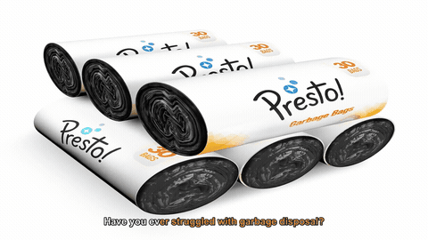

# NovaReel — AI Marketing Video Generator

Turn product photos into polished marketing videos in under 2 minutes.
Upload images → AI writes the script, narrates it, picks visuals → exports MP4 + subtitles.

**Live app:** https://master.dawy33xcd35b4.amplifyapp.com

---

## Demo Videos

| Chair Ad (16:9) | Lifestyle Focus | Product Closeup |
|---|---|---|
| [](https://youtu.be/ugM4mCQKkFw) | [](https://youtu.be/qh6Hs8fxs30) | [](https://youtu.be/5PiyjS0ug_Q) |

---

## How It Works

```
User uploads product images + writes description
         ↓
Nova Pro orchestrates the pipeline (agentic loop):
  1. Analyze images    → understand product visuals
  2. Generate script   → 6-scene narration via Nova Lite
  3. Synthesize audio  → EdgeTTS / ElevenLabs / Polly → MP3
  4. Plan media        → decides product closeup / B-roll / AI image per scene
  5. Generate AI images → Nova Canvas creates brand lifestyle shots
  6. Render video      → ffmpeg zoompan slideshow → MP4 + thumbnail + SRT
         ↓
         MP4 stored in S3, URL returned to frontend
```

---

## Tech Stack

| Layer | Technology |
|---|---|
| Frontend | Next.js 14 (App Router), TypeScript, Clerk auth |
| Backend API | FastAPI (Python 3.12), Pydantic v2 |
| Worker | `worker.py` polling SQS (or local queue in dev) |
| Orchestrator | **Amazon Nova Pro** — drives the full pipeline via tool-use loop |
| Script generation | Amazon Nova Lite (via Bedrock) |
| Voice / TTS | EdgeTTS (default) · ElevenLabs · Amazon Polly |
| AI image gen | **Amazon Nova Canvas** — contextual brand images from product photos |
| B-roll planning | Nova Vision — plans and validates stock footage per scene |
| Stock footage | Pexels API |
| Video render | ffmpeg (zoompan Ken Burns effect + audio mux) |
| Storage (dev) | Local filesystem |
| Storage (prod) | AWS S3 + DynamoDB |
| Hosting | AWS ECS Fargate (API + worker) · AWS Amplify (frontend) |
| Auth | Clerk RS256 JWT verified via JWKS |

---

## Storage Layout

Every job produces files under a consistent path structure in S3 (or local `data/storage/` in dev):

```
projects/{project_id}/
  assets/
    {asset_id}-filename.jpg          ← uploaded product images (input)

  clips/{job_id}/
    broll_001.mp4                    ← downloaded Pexels stock footage clips
    ai_gen_002.jpg                   ← Nova Canvas generated image
    ai_gen_002.mp4                   ← that image converted to a video segment

  intermediate/{job_id}/             ← resumable pipeline cache (deleted on success)
    image_analysis.json
    script_scenes.json
    storyboard.json
    orchestrator_result.json
    word_timings.json

  outputs/{job_id}/
    {job_id}.mp4                     ← final rendered video
    {job_id}.mp3                     ← narration audio track
    {job_id}.jpg                     ← thumbnail
    {job_id}.srt                     ← subtitles
    {job_id}.txt                     ← plain transcript
```

> **Intermediate files** are automatically deleted when a job completes successfully. They exist only to allow resuming a failed job mid-pipeline without re-running expensive AI steps.

---

## What Is B-Roll?

**B-roll** is supplementary footage interleaved with the main product shots to make the video feel dynamic rather than a static slideshow. NovaReel has three types of visual segments:

| Type | Source | When used |
|---|---|---|
| **Product closeup** | Your uploaded images | Always — the default for every scene |
| **B-roll** | Pexels stock footage (free API) | `product_lifestyle` / `lifestyle_focus` styles |
| **AI-generated image** | Nova Canvas (from your product as reference) | When B-roll doesn't fit or Vision Director decides a campaign image works better |

The **Vision Director** (Nova Vision) plans which type to use per scene, downloads Pexels candidates, validates them for relevance (score ≥ 6/10), and falls back to product images if nothing passes.

---

## Repository Structure

```
marketting-tool/
  apps/web/                          # Next.js frontend
    components/project-studio.tsx    # Main generate UI
    lib/api.ts                       # All API calls
  services/backend/
    app/
      api/v1.py                      # REST endpoints
      services/
        pipeline.py                  # Full job orchestration
        storage.py                   # Local / S3 abstraction
        video.py                     # ffmpeg rendering
        zoom_utils.py                # Ken Burns zoompan filter builder
        parallel.py                  # Parallel segment rendering
        orchestrator.py              # Nova Pro agentic loop
        nova.py                      # Bedrock script/match/analyze
        image_generator.py           # Nova Canvas image gen
        broll_director.py            # Vision Director (B-roll planning)
      repositories/
        dynamo.py                    # DynamoDB (prod)
        local.py                     # JSON file (dev)
    worker.py                        # SQS / poll job runner
  infra/
    cloudformation.yml               # Full AWS stack (ECS, S3, DDB, SQS, ALB)
    docker/Dockerfile.api
    docker/Dockerfile.worker
    scripts/deploy.sh                # Build → ECR push → CloudFormation deploy
```

---

## Local Development

```bash
# 1. Backend API
cd services/backend
python3 -m venv .venv && source .venv/bin/activate
pip install -e .[dev]
uvicorn app.main:app --reload --port 8000

# 2. Worker (separate terminal, same venv)
source services/backend/.venv/bin/activate
python services/backend/worker.py

# 3. Frontend
cd apps/web && npm install && npm run dev
# → http://localhost:3000  |  API docs: http://localhost:8000/docs
```

Default config runs with **mock AI** (no Bedrock calls) and **local storage** (no AWS needed).

### Enable real AI locally

```bash
export NOVAREEL_USE_MOCK_AI=false
export NOVAREEL_AUTH_DISABLED=true
export AWS_ACCESS_KEY_ID=...
export AWS_SECRET_ACCESS_KEY=...
export AWS_REGION=us-east-1
```

---

## Key Environment Variables

| Variable | Dev default | Purpose |
|---|---|---|
| `NOVAREEL_USE_MOCK_AI` | `true` | `false` → real Bedrock + ElevenLabs |
| `NOVAREEL_AUTH_DISABLED` | `true` | `false` → enforce Clerk JWT in prod |
| `NOVAREEL_CLERK_JWKS_URL` | — | `https://<instance>.clerk.accounts.dev/.well-known/jwks.json` |
| `NOVAREEL_STORAGE_BACKEND` | `local` | `dynamodb` in prod (uses S3 + DynamoDB) |
| `NOVAREEL_QUEUE_BACKEND` | `poll` | `sqs` in prod |
| `NOVAREEL_PUBLIC_API_BASE_URL` | `http://localhost:8000` | Set to Amplify HTTPS URL in prod |
| `NOVAREEL_ELEVENLABS_API_KEY` | — | Optional — enables ElevenLabs TTS |
| `NOVAREEL_PEXELS_API_KEY` | — | Required for B-roll stock footage |
| `NOVAREEL_FFMPEG_PRESET` | `veryfast` | H.264 encoding speed (`ultrafast` → `slow`) |

See `.env.production.example` for the full list.

---

## Production Deploy (AWS)

```bash
# Set credentials and config
source export_env.sh

# Build Docker images → push to ECR → update ECS via CloudFormation
./infra/scripts/deploy.sh

# Infra only (no Docker build)
./infra/scripts/deploy.sh --infra-only

# Skip Docker build (redeploy existing image)
./infra/scripts/deploy.sh --skip-build
```

### AWS Resources

| Resource | Name |
|---|---|
| ECS Cluster | `novareel-production` |
| ALB | `novareel-production-alb-*.us-east-1.elb.amazonaws.com` |
| S3 Bucket | `novareel-production-assets-{account_id}` |
| CloudFront | `https://dh4r7i40jtqy6.cloudfront.net` |
| Amplify | `https://master.dawy33xcd35b4.amplifyapp.com` |
| Log groups | `/novareel/production/api` · `/novareel/production/worker` |

```bash
# Tail live worker logs
aws logs tail /novareel/production/worker --follow --format short --region us-east-1
```

---

## Creating a GIF for the Repo

Extract a highlight clip from any generated video and convert it to a high-quality GIF using ffmpeg:

```bash
# Replace input.mp4 with your video, adjust -ss (start) and -t (duration)
ffmpeg -ss 2 -t 6 -i input.mp4 \
  -vf "fps=12,scale=600:-1:flags=lanczos,split[s0][s1];[s0]palettegen[p];[s1][p]paletteuse" \
  demo.gif
```

| Flag | What it does |
|---|---|
| `-ss 2` | Start at 2 seconds |
| `-t 6` | Capture 6 seconds |
| `fps=12` | 12 fps — smooth enough, keeps file small |
| `scale=600:-1` | 600px wide, height auto |
| `palettegen/paletteuse` | Two-pass palette — much better colour quality than default GIF |

Place the resulting `demo.gif` in the repo root and reference it at the top of this README with:
```markdown

```

---

## API Reference (v1)

| Method | Path | Description |
|---|---|---|
| `POST` | `/v1/projects` | Create project |
| `GET` | `/v1/projects` | List user projects |
| `POST` | `/v1/projects/{id}/assets:upload-url` | Get upload URL |
| `PUT` | `/v1/projects/{id}/assets/{aid}:upload` | Direct upload (dev) |
| `POST` | `/v1/projects/{id}/assets/{aid}:confirm-upload` | Mark asset uploaded (prod) |
| `POST` | `/v1/projects/{id}/generate` | Start video generation |
| `GET` | `/v1/projects/{id}/jobs` | List jobs for project |
| `GET` | `/v1/jobs/{job_id}` | Poll job status |
| `GET` | `/v1/projects/{id}/result` | Get completed video result |
| `GET` | `/v1/usage` | Monthly quota usage |

Full interactive docs at `http://localhost:8000/docs` when running locally.
